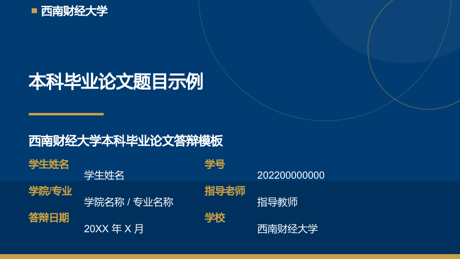
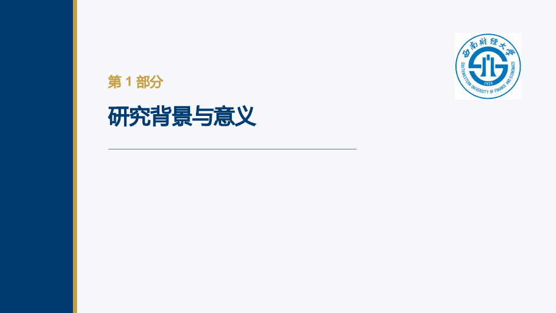

# 西南财经大学本科毕业论文答辩 Beamer 模板

这是一个面向西南财经大学本科毕业论文答辩场景的 XeLaTeX + Beamer 幻灯片模板。模板主题为“西南财经大学本科毕业论文答辩模板 / SWUFE Undergraduate Thesis Defense Beamer Template”，适合金融、金融数学、经济学、管理学、数据科学等专业使用。

模板风格正式、简洁、学术化，默认 16:9 页面比例，支持中文、英文、数学公式、表格、图片和代码片段。主要样式集中在 `beamerthemeSWUFE.sty`，示例答辩稿位于 `main.tex`，最小示例位于 `examples/minimal.tex`。

## 效果预览

> 📄 完整成品：[**main.pdf**](main.pdf)（24 页，直接在线浏览，无需安装 LaTeX）

| 封面 | 章节扉页（含校徽） |
| :--: | :--: |
|  |  |

如需本地编译查看完整答辩稿效果：

```bash
latexmk -xelatex main.tex
```

## 编译环境

请安装以下任一 TeX 发行版：

- TeX Live
- MacTeX
- MiKTeX

需要使用：

- XeLaTeX
- latexmk

推荐命令行编译，避免编辑器默认使用 pdfLaTeX 导致中文字体失败。

## 一键编译

在仓库根目录运行：

```bash
latexmk -xelatex main.tex
```

编译最小示例：

```bash
latexmk -xelatex examples/minimal.tex
```

清理编译缓存：

```bash
latexmk -C
```

## 字体说明

模板使用 `fontspec` 与 `xeCJK`，并在主题文件中设置常见系统字体 fallback。

中文主字体优先级：

- Windows: `SimSun`
- macOS: `Songti SC`
- Linux: `Noto Serif CJK SC`
- TeX Live fallback: `FandolSong-Regular`
- 兜底尝试: `Microsoft YaHei`

中文无衬线字体优先级：

- Windows: `Microsoft YaHei`
- macOS: `PingFang SC`
- Linux: `Noto Sans CJK SC`
- TeX Live fallback: `FandolHei-Regular`
- 兜底尝试: `SimSun`

中文等宽字体优先级：

- Windows: `KaiTi`
- Linux: `Noto Sans Mono CJK SC`
- TeX Live fallback: `FandolFang-Regular`
- 兜底尝试: `SimSun`

如果遇到“找不到字体”错误，请打开 `beamerthemeSWUFE.sty`，将 `\setCJKmainfont`、`\setCJKsansfont` 或 `\setCJKmonofont` 改为你电脑上已安装的中文字体。可在系统字体管理器中确认字体名称。Windows 用户通常可以使用 `Microsoft YaHei`、`SimSun`、`KaiTi`；macOS 用户通常可以使用 `PingFang SC`、`Songti SC`；Linux 用户建议安装 Noto CJK 字体。

## 替换校徽

模板已在每个章节扉页右上角放置校徽 `assets/logos/logo.png`（章节扉页模板见 `beamerthemeSWUFE.sty` 中的 `section page`）。

如需更换为自己的校徽：

1. 用官方授权的校徽文件替换 `assets/logos/logo.png`（保持透明背景效果最佳）。
2. 如需调整大小或位置，修改 `beamerthemeSWUFE.sty` 中 `section page` 里 `\includegraphics[width=1.9cm]{logo}` 一行。
3. 请确保校徽、校名与视觉识别资源的使用符合学校官方要求，使用者自行承担合规责任。

## 修改个人信息

在 `main.tex` 开头修改以下字段：

```tex
\title{论文题目}
\subtitle{西南财经大学本科毕业论文答辩模板}
\author{学生姓名}
\studentid{学号}
\school{学院}
\major{专业}
\supervisor{指导老师}
\date{答辩日期}
```

## 添加图片、表格、公式

图片建议放在 `assets/figures/`，并在正文中使用：

```tex
\includegraphics[width=0.85\linewidth]{figure-name.pdf}
```

表格建议使用 `booktabs`：

```tex
\begin{tabular}{lrr}
  \toprule
  指标 & 策略 A & 策略 B \\
  \midrule
  Sharpe & 0.52 & 0.60 \\
  \bottomrule
\end{tabular}
```

公式可直接使用 `amsmath`：

```tex
\[
  \sigma_p = \sqrt{w^\top \Sigma w}
\]
```

代码片段使用 `listings`，不需要 `-shell-escape`：

```tex
\begin{lstlisting}[language=Python]
print("SWUFE Thesis Defense")
\end{lstlisting}
```

## 常见问题

### 中文不显示

请确认使用 XeLaTeX 编译，而不是 pdfLaTeX：

```bash
latexmk -xelatex main.tex
```

### 找不到字体

请安装常见中文字体，或在 `beamerthemeSWUFE.sty` 中把字体名称改为本机已安装字体。Linux 用户建议安装 `Noto Sans CJK SC` 与 `Noto Serif CJK SC`。

### latexmk 命令不存在

请检查 TeX Live / MacTeX / MiKTeX 是否完整安装，并确认 TeX 的 `bin` 目录已加入系统 `PATH`。MiKTeX 用户可能还需要安装 Perl。

### 图片路径错误

请将图片放入 `assets/figures/`，并确认文件名大小写、扩展名和 LaTeX 中的路径一致。不要使用需要联网加载的图片。

## 许可证说明

模板代码可使用 MIT License。校徽、校名、学校视觉识别资源不包含在本模板授权范围内，用户需自行确保合规使用。

本模板参考了以下公开项目的工程思路与说明方式，但没有复制其论文类文件：

- [Marquis03/SWUFE-Thesis](https://github.com/Marquis03/SWUFE-Thesis)
- [sierxue/ThesisSWUFE](https://github.com/sierxue/ThesisSWUFE)

---

# SWUFE Undergraduate Thesis Defense Beamer Template

This is a XeLaTeX + Beamer slide template for undergraduate thesis defense at Southwest University of Finance and Economics. The theme is “SWUFE Undergraduate Thesis Defense Beamer Template” and is suitable for finance, financial mathematics, economics, management, data science, and related undergraduate programs.

The template is formal, clean, and academic. It uses a 16:9 aspect ratio by default and supports Chinese, English, mathematical formulas, tables, figures, and code snippets. Reusable visual styles are defined in `beamerthemeSWUFE.sty`; the full sample defense deck is in `main.tex`; a minimal example is in `examples/minimal.tex`.

## Preview

> 📄 Full deck: [**main.pdf**](main.pdf) (24 pages, view online — no LaTeX install required)

| Title page | Section divider (with logo) |
| :--: | :--: |
|  |  |

To build and view the full deck locally:

```bash
latexmk -xelatex main.tex
```

## Build Environment

Install one of the following TeX distributions:

- TeX Live
- MacTeX
- MiKTeX

Required tools:

- XeLaTeX
- latexmk

Command-line compilation is recommended to avoid accidentally using pdfLaTeX, which does not handle the CJK font setup used here.

## Build Commands

Compile the main example from the repository root:

```bash
latexmk -xelatex main.tex
```

Compile the minimal example:

```bash
latexmk -xelatex examples/minimal.tex
```

Clean generated files:

```bash
latexmk -C
```

## Font Notes

The template uses `fontspec` and `xeCJK`, with fallback logic in `beamerthemeSWUFE.sty`.

Chinese main font priority:

- Windows: `SimSun`
- macOS: `Songti SC`
- Linux: `Noto Serif CJK SC`
- TeX Live fallback: `FandolSong-Regular`
- Final attempt: `Microsoft YaHei`

Chinese sans font priority:

- Windows: `Microsoft YaHei`
- macOS: `PingFang SC`
- Linux: `Noto Sans CJK SC`
- TeX Live fallback: `FandolHei-Regular`
- Final attempt: `SimSun`

Chinese monospaced font priority:

- Windows: `KaiTi`
- Linux: `Noto Sans Mono CJK SC`
- TeX Live fallback: `FandolFang-Regular`
- Final attempt: `SimSun`

If LaTeX reports a missing font, edit `\setCJKmainfont`, `\setCJKsansfont`, or `\setCJKmonofont` in `beamerthemeSWUFE.sty` and replace the font name with one installed on your computer.

## Replacing the Logo

The template places the logo `assets/logos/logo.png` in the top-right corner of every section divider page (see the `section page` template in `beamerthemeSWUFE.sty`).

To use your own logo:

1. Replace `assets/logos/logo.png` with an officially authorized file (a transparent background works best).
2. To adjust size or position, edit the `\includegraphics[width=1.9cm]{logo}` line in the `section page` template inside `beamerthemeSWUFE.sty`.
3. Make sure all university names, logos, and visual identity resources are used lawfully and in accordance with official rules. The user is responsible for compliant use.

## Editing Personal Information

Edit the following fields near the top of `main.tex`:

```tex
\title{Thesis Title}
\subtitle{SWUFE Undergraduate Thesis Defense Beamer Template}
\author{Student Name}
\studentid{Student ID}
\school{School}
\major{Major}
\supervisor{Supervisor}
\date{Defense Date}
```

## Adding Figures, Tables, and Formulas

Place figures in `assets/figures/` and include them with:

```tex
\includegraphics[width=0.85\linewidth]{figure-name.pdf}
```

Use `booktabs` for clean tables:

```tex
\begin{tabular}{lrr}
  \toprule
  Metric & Strategy A & Strategy B \\
  \midrule
  Sharpe & 0.52 & 0.60 \\
  \bottomrule
\end{tabular}
```

Use `amsmath` for formulas:

```tex
\[
  \sigma_p = \sqrt{w^\top \Sigma w}
\]
```

Use `listings` for code snippets. No `-shell-escape` is required:

```tex
\begin{lstlisting}[language=Python]
print("SWUFE Thesis Defense")
\end{lstlisting}
```

## FAQ

### Chinese text does not appear

Make sure you compile with XeLaTeX:

```bash
latexmk -xelatex main.tex
```

### Font not found

Install common CJK fonts or replace the font names in `beamerthemeSWUFE.sty` with fonts installed on your machine. On Linux, installing Noto CJK fonts is recommended.

### latexmk is not found

Check that TeX Live, MacTeX, or MiKTeX is installed and that the TeX `bin` directory is on your system `PATH`. MiKTeX users may also need Perl.

### Figure path is wrong

Put figures in `assets/figures/` and verify that the filename, extension, and case match the LaTeX source. Do not use network-loaded images.

## License

The template code may be used under the MIT License. University logos, names, and visual identity assets are not covered by this template license. Users are responsible for compliant use.

This template refers to the engineering and documentation style of the following public projects, but does not copy their thesis class files:

- [Marquis03/SWUFE-Thesis](https://github.com/Marquis03/SWUFE-Thesis)
- [sierxue/ThesisSWUFE](https://github.com/sierxue/ThesisSWUFE)

